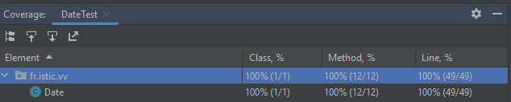
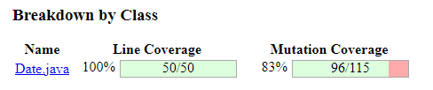
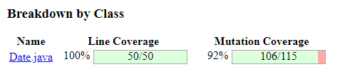
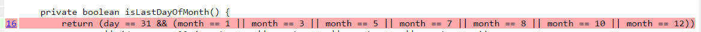
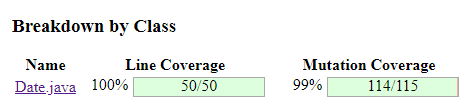
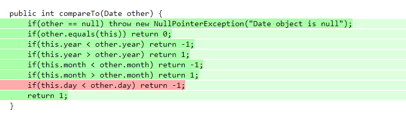

# Test the Date class

Implement a class `Date` with the interface shown below:

```java
class Date implements Comparable<Date> {

    public Date(int day, int month, int year) { ... }

    public static boolean isValidDate(int day, int month, int year) { ... }

    public static boolean isLeapYear(int year) { ... }

    public Date nextDate() { ... }

    public Date previousDate { ... }

    public int compareTo(Date other) { ... }

}
```

The constructor throws an exception if the three given integers do not form a valid date.

`isValidDate` returns `true` if the three integers form a valid year, otherwise `false`.

`isLeapYear` says if the given integer is a leap year.

`nextDate` returns a new `Date` instance representing the date of the following day.

`previousDate` returns a new `Date` instance representing the date of the previous day.

`compareTo` follows the `Comparable` convention:

* `date.compareTo(other)` returns a positive integer if `date` is posterior to `other`
* `date.compareTo(other)` returns a negative integer if `date` is anterior to `other`
* `date.compareTo(other)` returns `0` if `date` and `other` represent the same date.
* the method throws a `NullPointerException` if `other` is `null` 

Design and implement a test suite for this `Date` class.
You may use the test cases discussed in classes as a starting point. 
Also, feel free to add any extra method you may need to the `Date` class.


Use the following steps to design the test suite:

1. With the help of *Input Space Partitioning* design a set of initial test inputs for each method. Write below the characteristics and blocks you identified for each method. Specify which characteristics are common to more than one method.
2. Evaluate the statement coverage of the test cases designed in the previous step. If needed, add new test cases to increase the coverage. Describe below what you did in this step.
3. If you have in your code any predicate that uses more than two boolean operators check if the test cases written to far satisfy *Base Choice Coverage*. If needed add new test cases. Describe below how you evaluated the logic coverage and the new test cases you added.
4. Use PIT to evaluate the test suite you have so far. Describe below the mutation score and the live mutants. Add new test cases or refactor the existing ones to achieve a high mutation score.

Use the project in [tp3-date](../code/tp3-date) to complete this exercise.

## Answer

### 1. Input Space Partitioning

Liste des partitions:

* **invalid date**:
  * `invalid day`: (day < 1 or day > 31 ) and month and year valid
  * `invalid day upper for 30 days month`: day == 31 && month in [4, 6, 9, 11] and year valid
  * **invalid day in februrary** :
    * `invalid day upper for 28 days`: day == 29 && month == 2 && !isLeapYear(year) and year valid
    * `invalid day upper for 29 days`: day == 30 && month == 2 and year valid
  * `invalid month`: (month < 1 or month > 12) and day valid and year valid
  * `invalid year`: year < 0 and day and month valid
  * `invalid day and month`: (day < 1 or day > 31) and (month < 1 or month > 12) and year valid
  * `invalid day and year`: (day < 1 or day > 31) and month valid and year < 0
  * `invalid month and year`: (month < 1 or month > 12) and day valid and year < 0
  * `invalid day, month and year`: (day < 1 or day > 31) and (month < 1 or month > 12) and year < 0
  
* **valid date**:
  * **last day of month**
    * `last day of month with 30 days`: day == 30 and month in [4, 6, 9, 11]
    * **last day of month with 31 days**
      * `last day of month with 31 days (except december)` : : day == 31 and month in [1, 3, 5, 7, 8, 10]
      * `last day of year`: month == 12 and day == 31
    * `last day of februrary leap year`: day == 29 and month == 2 and isLeapYear(year)
    * `last day of februrary non leap year`: day == 28 and month == 2 and !isLeapYear(year)
  * **first day of month**
    * `first day of month with 30 days`: day == 1 and month in [4, 6, 9, 11]
    * **first day of month with 31 days**
      * `first day of month with 31 days (except january, march)` : : day == 1 and month in [5, 7, 8, 10, 12]
      * `first day of year`: month == 1 and day == 1 and year != 0
      * `first valid date` : month == 1 and day == 1 and year == 0
      * `first day of march leap year`: day == 1 and month == 2 and isLeapYear(year)
      * `first day of march non leap year`: day == 1 and month == 2 and !isLeapYear(year)
  * **other day**: 
    * `leap year` : day != 1 and day != 31(30, 29, 28) and month != 1 and month != 12 and valid date
    * `not leap year` : day != 1 and day != 31(30, 28) and month != 1 and month != 12 and valid date

Chaque intersection de partitions est vide et l'union de toutes les partitions est l'ensemble du domaine d'input.

Pour chaque méthode, on testera un input venant de chaque partition que l'on veut tester par méthode. Parfois, on ne souhaitera pas forcément tester un input venant d'une partition particulière, mais plutôt n'importe quel input d'un groupement de partitions. Les différents groupements sont listés au-dessus (texte non surligné).


Liste des partitions testées pour chaque méthode :
#### isValidDate()

| Partitions Testées                     |
|----------------------------------------|
| "invalid date"->`all`                  |
| "valid date"->last_day_of_month->`all` |
| "valid date"->other_day->`any`         |

#### constructor

| Partitions Testées    |
|-----------------------|
| "invalid date"->`any` |
| "valid date"->`any`   |

#### isLeapYear()

| Partitions Testées                       |
|------------------------------------------|
| "invalid date"->`invalid year`           |
| "valid date"->other_day->`leap year`     |
| "valid date"->other_day->`not leap year` |

#### nextDate()

| Partitions Testées                      |
|-----------------------------------------|
| "valid date"->last_day_of_month->`all`  |
| "valid date"->other_day->`any`          |

#### previousDate()

| Partitions Testées                      |
|-----------------------------------------|
| "valid date"->first_day_of_month->`all` |
| "valid date"->other_day->`any`          |

#### compareTo()

| Partitions Testées                    |
|---------------------------------------|
| null value                            |
| "valid date"->`any` (date1 == date2)  |
| "valid date"->`any` (year1 < year2)   |
| "valid date"->`any` (year1 > year2)   |
| "valid date"->`any` (month1 < month2) |
| "valid date"->`any` (month1 > month2) |
| "valid date"->`any` (day1 < day2)     |
| "valid date"->`any` (day1 > day2)     |

#### equals()
| Partitions Testées                   |
|--------------------------------------|
| null value                           |
| same object                          |
| different class object               |
| "valid date"->`any` (date1 == date2) |
| "valid date"->`any` (date1 != date2) |

### 2. Code Coverage

On lance donc nos tests à l'aide du code coverage d'IntelIJ. On obtient un score de 100% ce qui nous montre que nos tests couvrent déjà 100% de notre code. (Ce résultat ne témoigne pas forcément d'une absence de bug)
Néanmoins, il n'y donc aucun test à ajouter à cette étape.



### 3. Base Choice Coverage

Pour s'assurer de la validité de la date, ou encore de pouvoir détecter les spécificités liées aux années bissextiles et les mois de différentes tailles, il y a un grand nombre de conditions booléennes.

#### Constructeur :

On a un booléen vérifiant la validité de la date et nous avons déjà deux tests pour le constructeur avec un input valide et un input invalide.
Il n'y a donc rien à ajouter ici.

#### isValidDate :

On teste déjà les premières conditions sur les nombres limites des jours, mois et années.
Ensuite, pour les jours en février, on a déjà un test qui passe par chaque évaluation booléenne de la condition.
Pour les mois à 30 jours, on ne teste pas vraiment tous les mois qui ont 30 jours dans les tests. On peut donc ajouter quelques tests qui vérifient les mois de 30 jours.

#### isLeapYear :

Ici, on a 3 opérations booléennes. On remarque que nous n'avons pas testé le cas d'une bissextile qui est modulo 400. On peut donc déjà ajouter un test pour ça.
Nous n'avions également pas testé le cas d'une année divisible par 4 et 100 en même temps, on peut donc rajouter un autre test pour ça.

#### nextDate :

Pour nextDate, nous avons déjà testé tous les cas de conditions où le jour représente la fin d'un mois et aussi de l'année.
On a testé une date au milieu d'un mois, donc il n'y a pas vraiment de tests à rajouter pour le Base Choice Coverage.

#### previousDate :

Pour previousDate, nous avons déjà testé tous les cas de conditions où le jour représente le début d'un mois et aussi de l'année.
On a testé une date au milieu d'un mois, donc il n'y a pas vraiment de tests à rajouter pour le Base Choice Coverage.

#### compareTo :

Pour compareTo, on a de simple if à une condition booléenne et on a déjà un test par condition. On a juste constaté le manque d'un test pour une valeur null.
### 4. Mutation :

On lance donc un mutation Coverage avec PIT. A la fin du test, 96 mutations ont été tuées sur un total de 115. Il faut donc étudier les cas pour voir si ce sont des mutations équivalentes ou pas.



La première cause de ce résultat était l'utilisation d'un @Before pour initialiser un objet Date qui pouvait servir pour plusieurs tests. On a donc retiré cette annotation et on a créé un nouvel objet Date pour chaque test.



Ensuite, on s'intéresse à une ligne qui n'est pas correctement testée. Il s'agit de la méthode privée isLastDayOfMonth(), en changeant des égalités pour les mois de 31 jours, les tests passent toujours.



Pour fixer cela, on ajoute dans les tests de nextDate(), des cas pour chaque fin de mois de 31 jours.
Ces nouveaux cas de tests permettent de tuer les mutations.



Le dernier mutant qui survit est un mutant équivalent.



Le mutant équivalent remplace l'opérateur "<" par l'opérateur "<=" dans la méthode compareTo() à l'avant-dernière ligne. Cela n'a pas d'impact sur le comportement du code, car arrivé à cette ligne, on sait que this.year == other.year et this.month == other.month.
Donc si on rajoute un égal au jour, on ne pourra plus arriver à cette ligne, car le cas de l'égalité des dates est traité à la deuxième ligne.